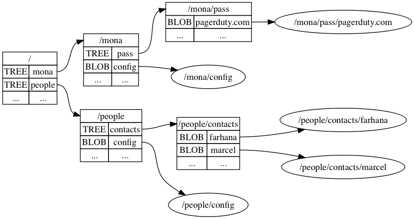

# GitDB

###### A Security First Datastore for User Focused Applications

GitDB aims to provide an encrypted distributed database for offline first user focused apps. Think todo apps, password managers, etc.

Applications built using GitDB give users control over their data while maintaining the many of the conveniences of centralized applications.

By using Git we inherit:

1. a solid distributed foundation for our database

2. all existing infrastructure and tooling for managing Git repositories (github, gitlab, etc.)

On top of Git, GitDB adds encryption, a collection of CRDT data structures, and a Query interface.

## Design

Staying true to Git's roots, GitDB wraps a tree based key value store on top of a content addressable storage (CAS) core.

We add 4 concepts on top of Git: `Block`, `Path`, `TreeBlock` and `BlobBlock`. These are encrypted varients of the familiar Git concepts of the `Object`, `file path`, `Tree` and `Blob` respectively.

#### Block

A `Block` is a single unit of data, `Block`'s are encrypted and stored on disk as a Git blob.

#### Path

A `Path` is a unique name that maps to a `Block`.

###### Path Format

`Path`'s begin with a `/` and are followed by zero or more *Path Components* interspersed with `/` .

*Path components* may contain any unicode charactor besides the special charactors, special charactors are `\` and `/`. To use a special charactor you'll need to prefix it with the escape charactor `\`.

*valid paths:* `/`,  `/a`, `/a/bb/ccc`, `/ /a\/b\\&$#/c `

*invalid paths:*

- ` ` : the empty path is invalid.
- `/a/ ` : paths can't end in a `/`.
- `/a//c` : paths can't have empty components.
- `/a\b` :  can't escape non-special charactors.

###### Mapping a Path to a file on disk

To avoid leaking information about what is stored  on disk GitDB goes through a path obfuscation step before writing a file to disk.

An encrypted salt is stored at the root of the Git repository `./salt`.

```haskell
path <- "/a/b/c"
encrypted_salt <- os.fs.read("$GIT_ROOT/salt")
salt <- decrypt(secret_key, encrypted_salt) -- suppose salt == '$'
obf <- sha256(salt ++ path) -- => sha256("$/a/b/c")
-- => d61f774e6a38d6d9031ab6ccf281c6275a8f835b73134afc2f626a97bde0b87a
path_on_disk <- os.fs.path.join("$GIT_ROOT"), "cryptic", obf[0..2], obf[2..])
-- => $GIT_ROOT/cryptic/d6/1f774e6a38d6d9031ab6ccf281c6275a8f835b73134afc2f626a97bde0b87a
```

#### TreeBlock

A `TreeBlock` is a `Block` that stores relationships between `Path`'s and `Block`'s. A `TreeBlock` stores entries of path's with a common prefix along with a flag telling us if this sub path is a `TreeBlock` or a `BlobBlock`.

ie. If we've got a `BlobBlock` in our DB with path `/a/b`, then:

 the root tree `/` will have an entry: `TREE: a`

the `/a` tree will have an entry: `BLOB: b`

#### BlobBlock

A `BlobBlock` is a block that appears in a `TreeBlock` with a `BLOB` flag. There's nothing else to differentiate a `BlobBlock` from another `Block`.

### A Worked Example

Suppose we've got two applications using the same GitDB database. `Mona: a password manager`, and `People: a contacts manager`.

At the root we've got two path's `/mona` and `/people`, beneath these namespaces, the apps store their data.

###### State of GitDB (assume salt == "")

| Path                     | Path on disk             |
| ------------------------ | ------------------------ |
| /                        | ./cryptic/f4/65c3...4336 |
| /mona                    | ./cryptic/aa/d821...03b9 |
| /mona/config             | ./cryptic/f9/d010...a68c |
| /mona/pass               | ./cryptic/48/b343...81ad |
| /mona/pass/pagerduty.com | ./cryptic/77/dbbe...18fb |
| /people                  | ./cryptic/00/fcbb...9fc3 |
| /people/config           | ./cryptic/e4/3d3e...fe40 |
| /people/contacts         | ./cryptic/9d/0fc8…7bf2   |
| /people/contacts/farhana | ./cryptic/48/bf31...f6cb |
| /people/contacts/marcel  | ./cryptic/88/a07e...8f8b |

###### Traversing TreeBlock's from the root TreeBlock

</img>

### Analysis of GitDB actions

#### `db.tree_block(<path>)`

Opens the requested `TreeBlock`, creating if it does not exist

```
db.tree_block("/a/b")
```

**prior state:** `salt == "$"`, `TreeBlock(/a)`, `TreeBlock(/a/b)` do not exist, `TreeBlock(/)` exists.

1. `sha256("$/a/b") -> 03d4a92a45e0cddf2ec5a73efdd2582355d1df5ae80aae52f6b46d41f5607a4c`

2. convert hash to path on disk: `./cryptic/03/d4a92a45e0cddf2ec5a73efdd2582355d1df5ae80aae52f6b46d41f5607a4c`

3. attempt to decrypt this file, fails since it doesn't exist

4. recursively call  `let mut parent = db.tree_block("\a")`

5. add entry `b` to `/a` namespace: `parent.add_entry("b", TREE);`

6. create empty `TreeBlock`, encrypt and store on disk at:

    `./cryptic/03/d4a92a45e0cddf2ec5a73efdd2582355d1df5ae80aae52f6b46d41f5607a4c`

Git repository state after call:

```
modified: ./cryptic/fe409a363a6f...38d78cb1e7211a5b // derived from sha256("$/")
new file: ./cryptic/a25c798de63c...b0ef3c2e49f67054 // derived from sha256("$/a")
new file: ./cryptic/03/d4a92a45e...f6b46d41f5607a4c // derived from sha256("$/a/b")
```

#### `db.put(<path>)`

```rust
db.put("/a/b/c", <encrypted blob>);
```

**prior state:** `salt == "$"`, `TreeBlock(/a/b)` exists.

1. `sha256("$/a/b/c") -> d61f774e6a38d6d9031ab6ccf281c6275a8f835b73134afc2f626a97bde0b87a`
2. convert hash to path on disk: `./cryptic/d6/1f774e6a38d6d9031ab6ccf281c6275a8f835b73134afc2f626a97bde0b87a`
3. Ensure path doesn't exist
4. open`TreeBlock(/a/b)`: `let mut tree = db.tree_block("/a/b");`
5. add blob entry `c`  `TreeBlock(/a/b)`: `tree.add_entry("c", BLOB)`;
6. Write `<encrypted blob>` to `./cryptic/d6/1f774e6a...b87a`

Git repository state after call:

```
modified: ./cryptic/03/d4a92a45...7a4c // derived from sha256("$/a/b")
new file: ./cryptic/d6/1f774e6a...b87a // derived from sha256("$/a/b/c")
```

#### `db.get(<path>)`

```rust
db.get("/a/b/c")
```

**prior state:** `salt == "$"`, `BlobBlock(/a/b/c)` exists.

1. `sha256("$/a/b/c") -> d61f774e6a38d6d9031ab6ccf281c6275a8f835b73134afc2f626a97bde0b87a`
2. convert hash to path on disk: `./cryptic/d6/1f774e6a38d6d9031ab6ccf281c6275a8f835b73134afc2f626a97bde0b87a`
3. read file from disk: `let encrypted_blob = os.fs.read("./cryptic/d6/1f77...b87a")`
4. decrypt: `let blob = decrypt(secret_key, encrypted_blob)`

*Git repository is unchanged after call*

#### `db.rm(<path>)`

```rust
db.rm("/a/b/c");
```

**prior state:** `salt == "$"`, `TreeBlock(/a/b)` exists.

1. open`TreeBlock(/a/b)`: `let mut tree = db.tree_block("/a/b");
2. remove `c` entry from  namespace: `ns.rm_entry("c");`
3. `sha256("$/a/b/c") -> d61f774e6a38d6d9031ab6ccf281c6275a8f835b73134afc2f626a97bde0b87a`
4. convert hash to path on disk: `./cryptic/d6/1f774e6a38d6d9031ab6ccf281c6275a8f835b73134afc2f626a97bde0b87a`
5. delete the file

Git repository state after call:

```
modified: ./cryptic/03/d4a92a45...7a4c // derived from sha256("$/a/b")
deleted:  ./cryptic/d6/1f774e6a...b87a // derived from sha256("$/a/b/c")
```

### Crypto

#### Avoiding Nonce Reuse Attacks (by not using nonces)

*WORKAROUND UNTIL https://github.com/briansmith/ring/issues/411 IS RESOLVED*

As described in https://tools.ietf.org/html/rfc5116#section-3.1 

> Many problems with nonce reuse can be avoided by changing a key in a situation in which nonce coordination is difficult.

Since we are using an encryption algorithm who's nonce is 96bits, the nonce space is not large enough to give us confidence in random nonces.

Instead we use randomly generated 256bit salts as inputs to our kdf to give us unique encryption keys each time we encrypt. Salts are never reused.

Why is this done? Protecting against nonces reuse in a distributed system is difficult, for instance if we use naive incrementing nonces, we could enter a situation where two sites both modify and re-encrypt the same block: both sites would increment the same nonce but they are encrypting (potentially) different plaintext, if we are not careful how we resolve this conflict we will expose the secret key.

#### key files

Key files random 256 bit keys  that are used to add additional entropy into the key derivation process. They are stored in plaintext on each site, but never leaves your device (in plaintext).

The same key file must be present on each site to access your data.

**TODO: how to do key_file sharing? probably need to do a key echange** https://briansmith.org/rustdoc/ring/agreement/index.html

#### Key Derivation

###### key material

**key_file:** random 256 bits stored in plaintext on each site, keep this hidden from any third party.

**master_passphrase:** strong user chosen passphrase.

**block_salt:** randomly generated salt per block. Protects us from nonce reuse and input to pbkdf2.

**block_iters:** input to pbkdf2

###### kdf algorithm

```haskell
INPUT: key_file          -- 256b key file from site (not stored in GitDB)
INPUT: master_passphrase -- read from users mind
INPUT: block_salt        -- random salt per block
INPUT: block_iters       -- extracted from Block

pbkdf2_key <- PBKDF2(
  algo: SHA_256,
  pass: master_passphrase,
  salt: block_salt,
  iters: block_iters,
  length: 256
)

key <- pbkdf2_key XOR key_file

OUTPUT: key
```

#### Encryption

```haskell
INPUT: key_file          -- 256b key file from site (not stored in GitDB)
INPUT: master_passphrase -- read from users mind
INPUT: plaintext         -- plaintext data to encrypt

block_salt <- rand(256)  -- random 256bit salt
block_iters <- 1000000   -- u32 read from config

-- See above for kdf algorithm
key <- kdf(key_file, master_passphrase, block_salt, block_iters)

ciphertext <- AEAD_encrypt(
  algo: CHACHA20_POLY1305
  secret_key: key,
  nonce: 0, -- nonce not used, see above section on nonce reuse
  ad: block_salt ++ block_iters
)

block <- block_iters ++ block_salt ++ ciphertext
--     | 32bit uint  |  256bit salt | <n>bit ciphertext |       

OUTPUT: block
```


#### Decryption

```haskell
INPUT: key_file          -- 256b key file from site (not stored in GitDB)
INPUT: master_passphrase -- read from users mind
INPUT: block             -- block to decrypt

block_iters <- block[0..32]
block_salt <- block[32..(32 + 256)]
ciphertext <- block[(32+256)..block.len()]

-- See above for kdf algorithm
key <- kdf(key_file, master_passphrase, block_salt, block_iters)

plaintext <- AEAD_decrypt(
  algo: CHACHA20_POLY1305
  secret_key: key,
  nonce: 0, -- nonce not used, see above section on nonce reuse
  ad: block_salt ++ block_iters
)

OUTPUT: plaintext
```


## Automating Merge Conflicts with CRDT's

GitDB is meant to be used in an offline first context, this necessarily means that conflicts are bound to happen and managing these conflicts in an unintruisive way is paramount to building useful applications on top of GitDB.

GitDB leans heavily on the fantastic [Ditto](https://github.com/alex-shapiro/ditto) collection of CRDT data structures. As long as you only use Ditto structures, conflicts will be handled automatically for you.

Unfortunately, Ditto does not help us in choosing a site identifier

### Assigning Site ID's

Random u32 checked against existing site identifiers, that's all we've got right now.

This gives us a probability of collision between two new offline devices at a bit over $10^{-10}$. Not great, but it'll do for now.

### Merge Procedure

#### Remote Ordering

The order of pushing to remotes is meaningfully, if clients don't all iterate in the same order there is potential for remotes to never converge to each other.

For example consider a situation with two sites and two remotes and both sites choose different first push remotes. In the case where both sites differ in commit history, you will enter a situation of repeated indefinite merging and pushing (assuming the worst case where operations are happening in lockstep and merges by sites differ in some way).

To avoid this, we iterate remotes in the same order on each site, on conflict, we stop iterating, merge the conflict and restart the push iteration from the beginning.

In pseudo code:

```rust
let repo = git.open_repo("$GIT_ROOT");

let push_succeded = false;
while !push_succeeded {
    push_succeeded = true;
    for remote in repo.remotes.sort().iter() {
        remote.fetch();
        repo.merge(remote.refspec())
        if repo.index.has_conflict() {
            // <handle_conflict>
            push_succeeded = false;
            break;
        }
    }
}
```

#### Conflict Resolution

##### Case

modified `A:/a`

modified `B:/a`

##### resolution

`encrypt(output="/a", plain=merge(decrypt(A:/a), decrypt(B:/a)))`

##### Case

modified `A:/a`

deleted `B:/a`

##### resolution

keep `A:/a`